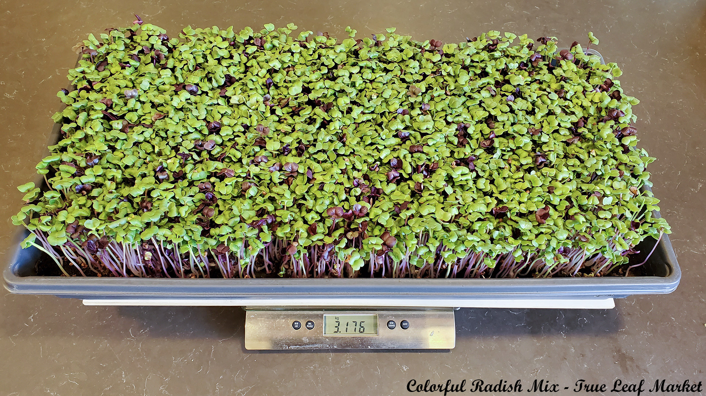

## Welcome!

Welcome to my microgreens site.  This is an ever evolving site that captures my current microgreen's experiences and operations.  I've been at this since about September 2020.  I am by no means an expert, but I've been very successful so far.  I grow strictly for personal consumption and to sell/give-asway my immediate neighbors and friends.  At this point I have no intention of scaling up my operation to be a business  Why not, you ask?  Many reasons!  

* This is a hobby for me. Keeps it fun. If I want to take a vacation, I can without worrying about delivery commitments.
* I have a full-time job (31 years as a software developer and still going...).
* I'm not young.  I think more about winding down, then winding up.
* I'm busy with many other projects (mostly around the farm, keeping things running).

This page is constructed using github pages.  It is completely open-sourced.  If you would like to build your own webpage for your operation feel free [fork this repo](https://github.com/mgfarmer/mg) and use it as a starting point. 

If you have comments, questions, or suggestion about growing microgreens, or about this site, you can contact me at mgfarmer@laddhillfarm.com or [iamashaman](https://www.reddit.com/user/iamashaman) on reddit. 

Affiliate Links? Yes.

## Photographing Microgreens

Sure, easy enough. Point a camera and take a picture! And that's mostly what I'm doing.  

But between natural light (from Windows), normal room lighting (LED), and grow lights (weird LEDs) camera don't stand chance of capturing an accurate white balance (because all the light sources have different white balances).  So pictures on this page taken with the grow lights on look strange.  The human eye, and brain, is amazingly adept at making everything look "normal", the cameras, not so much.  So please pardon the "off color" images.

## Where I Grow

When I first started this (mid-pandemic, autumn 2020) I built a simple small rack and kept it in the living room.  It was capable of growing three 10x20 trays.  Once I caught the mg growing bug, however, I knew I needed a bigger rack and was "encouraged" to find someplace not in the main living quarters of the house. So...

I've been working full-time from home for several years. I have a nice home office. My office is technically a bedroom in our house. It also has a large sliding glass door that exits to the backyard. It is the main egress to the backyard. So calling it a bedroom is kind of a non-starter. It is an office. It has one of those closets that usually have a set of bifold doors, so it is quite wide and 24"/70cm deep.  This closet is where I grow.  Before the closet could become a growing facility it needed to be "remodeled" so that it would be visually pleasing with the door removed. So I:

* Removed the bifold doors.
* Trimmed-out the entire closet in bead board (and about 6 tubes of caulk).
* Added shelves to the sides, leaving the entire center portion of the closet open.  
* Added a 12"x36" LED panel light to the top of the closet ceiling (this is closet task lighting, not a grow light).
* Added a light switch just outside the closet for the ceiling light.
* Added a power outlet to the rear closet wall (to power printers, switches, growlight, etc...).
* Added an Ethernet port to the rear closet wall (for my printers, not used in microgreen growing...yet).

I turned the grow light off in this pic because they overwhelm the other lighting.

This is where my grow rack lives now.  The shelves are arranged as:

Shelf | Notes
---- | ----
Top | Holds all the power and network infrastructure, generally out-of-sight so it's not clean.
2-3 | Grow Shelves: This let's me grow up to 8 trays simultaneously.
4 | Printer shelf.  So glad to get these off my desktop.
5 | Shoe shelf. So glad to get all of these of the floor by the door.

If you look closely at the picture above you might deduce (correctly!) that I'm a little OCD about cable management, but only when those cables would be visible.  When it comes to cables in hidden places, I don't bother.  So there are two printers (with power and network cables), 16 fans, and 16 grow lights.  And while the cabling is not 100% perfectly hidden, it is a very clean installation.  For the fans and lights I built custom wiring harnesses to minimize the number of wires that needed managing.  All cables are zip-tied neatly along the backside of the shelf wires and legs.

## Equipment

This is all the equipment I'm using.

Thing | Notes
---- | ----
Grow Rack | A standard 72" tall, 48" wide, 24" deep NSF wire rack.  I got mine from [Costco](https://www.costco.com/trinity-ecostorage-5-tier-wire-shelving-rack-48%22-x-24%22-x-72%22-nsf%2c-includes-wheels%2c--chrome.product.100143963.html), but you can also get it from [Amazon](https://www.amazon.com/gp/product/B07QZP5ZN4/ref=as_li_qf_asin_il_tl?ie=UTF8&tag=mgfarmer-20&creative=9325&linkCode=as2&creativeASIN=B07QZP5ZN4&linkId=32060cc6f447f65da15736558a08bff0).  There are many others as well.  72" high was perfect for my closet.
[Shelf Liners](https://www.amazon.com/gp/product/B07KCMHMQN/ref=as_li_qf_asin_il_tl?ie=UTF8&tag=mgfarmer-20&creative=9325&linkCode=as2&creativeASIN=B07KCMHMQN&linkId=01a9a17e9cc45b4c89cad5b1cc387bac) | These are really nice shelf liners.  They are heavy duty and will not curl.  It comes in a four pack so my top shelf does not get one, but all other shelves do.  They keep soil and water (from potential leaking trays..but none have leaked yet) from falling on to my printers.  Totally worth it!
[Grow Lights](https://www.amazon.com/gp/product/B07VD1884R/ref=as_li_qf_asin_il_tl?ie=UTF8&tag=mgfarmer-20&creative=9325&linkCode=as2&creativeASIN=B07VD1884R&linkId=0ccd1d73a97e831a194d6f5682d26deb) | 2 8-packs of T5 grow lights.  These fit perfectly (front-to-back) in the rack.  They are all attached using zip-ties.
[Fans](https://www.ebay.com/itm/303454917400) | There are 16 fans.  They are just inexpensive 12V 120mm computer fans. I purchased mine from newegg (via ebay). Looks for them in multipacks, you'll get a better price per fan that way. I paid about $78 for all 16 fans, so just about $5 per fan.
[12V Power Supplies](https://www.amazon.com/gp/product/B08F7KMRBG/ref=as_li_qf_asin_il_tl?ie=UTF8&tag=mgfarmer-20&creative=9325&linkCode=as2&creativeASIN=B08F7KMRBG&linkId=6e2095bc2d28fab0cae7f1079de98765) | These power the fans.  The 16 fans, in total, draw less then 3 amp when they are all running. So any supply that provide 3A or more is sufficient.  Since I want to control the power to the fans on each shelf independently I am using two of these supplies.
[Powerstrip](https://www.amazon.com/gp/product/B07QRGCLCQ/ref=as_li_qf_asin_il_tl?ie=UTF8&tag=mgfarmer-20&creative=9325&linkCode=as2&creativeASIN=B07QRGCLCQ&linkId=f6b0b03d6df0bd55daedee77648bbfb0) | Since I only put in a single duplex outlet I need a large power strip to plug everything into.  This goes  on the top shelf, out-of-sight.  It is attached with zip-ties to keep it in place.  This strip also has a 12 foot cord that makes pulling the whole shelving unit out very easy without having to depower anything.
[WiFi Outlets](https://www.amazon.com/gp/product/B07FVST9YN/ref=as_li_qf_asin_il_tl?ie=UTF8&tag=mgfarmer-20&creative=9325&linkCode=as2&creativeASIN=B07FVST9YN&linkId=466816a4074d12bb16fab80f9f5e100a) | There is a lot more detail about these below.  I use these to control the power to the lights and fans through my "smarthome" system.  They key features I needed in the outlet was that it be "SmartThings" compatible.  Many brands are not.
[Hygrometer Thermometer](https://www.amazon.com/gp/product/B07Y36FWTT/ref=as_li_qf_asin_il_tl?ie=UTF8&tag=mgfarmer-20&creative=9325&linkCode=as2&creativeASIN=B07Y36FWTT&linkId=9bae1ec4d785e99e3af085e9d93dacf5) | Always good to keep an eye on the temperature and humidity levels. I mounted this to the back wall of the closet near the grow shelf.
Label Printer | Very handy for labelling trays with the seed variety.  I use an old Epson LW400 that I've had for years, but it looks like Epson got out of the home label maker business.  Some something like the [Dymo](https://www.amazon.com/gp/product/B01BD6DRI6/ref=as_li_qf_asin_il_tl?ie=UTF8&tag=mgfarmer-20&creative=9325&linkCode=as2&creativeASIN=B01BD6DRI6&linkId=7fb8aa48275fc96bf6d293ff945761b5) looks like a good solution if you don't have one.  They are very handy for many things.
Grow Trays | I'm using standard 1020 grow trays.  I purchased 10-packs of [trays with holes](https://www.trueleafmarket.com/products/10-20-growing-trays-with-drain-holes?variant=38635276360) and [trays without holes](https://www.trueleafmarket.com/products/10-20-growing-trays-without-holes?variant=38551592072).  TLM says these are re-usable "when used gently".  I must be a gentleman because I'm getting many harvests from each set of trays with no cracking or wear visible yet. I'm still on my first set of trays after 9 months of growing.
Kitchen Scale | I use this when watering my trays, more on my watering technique below.  We've had our scale for many many years and it annoys me because it always powers up in Lbs/Oz mode and I like to use Kg mode (it is only a single button press to change, but still...).  I'm thinking about [this new one](https://www.amazon.com/gp/product/B088QZNJZP/ref=as_li_qf_asin_il_tl?ie=UTF8&tag=mgfarmer-20&creative=9325&linkCode=as2&creativeASIN=B088QZNJZP&linkId=4fbedee92342ac47243997b0a4ea3e01) because it will remember the last used setting (I asked, they answered).  I just don't feel good about replacing something that does work.
[Micro Scale](https://www.amazon.com/gp/product/B07D3PWMSY/ref=as_li_qf_asin_il_tl?ie=UTF8&tag=mgfarmer-20&creative=9325&linkCode=as2&creativeASIN=B07D3PWMSY&linkId=192f5c3bcdbff7b83191659b237a8183) | I originally purchased this to weigh espresso grind.  That got old fast!  Now I use it to weigh seed when planting.
[Stream Deck](https://www.amazon.com/gp/product/B06XKNZT1P/ref=as_li_qf_asin_il_tl?ie=UTF8&tag=mgfarmer-20&creative=9325&linkCode=as2&creativeASIN=B06XKNZT1P&linkId=3e7070b175f00a7308302dacc3d0df38) | This device is meant for Streamers (twitch, youtube, etc...).  I'm not a streamer.  But it is also a great device for controlling smart home devices from my primary desktop workstation.  I use to control the lights and fans.  Strictly optional!
[Kill-o-watt Meter](https://www.amazon.com/gp/product/B00009MDBU/ref=as_li_qf_asin_il_tl?ie=UTF8&tag=mgfarmer-20&creative=9325&linkCode=as2&creativeASIN=B00009MDBU&linkId=e8cc326cb8550018b838308fcb2053ec) | I have this for maybe 20 years and you can still buy them new.  For now it lives between my wall outlet and the grow rack measuring all my power usage.  With everything powered on, I'm drawing just over 100 watts.  Maybe a bit more when the printers are working.

## Growing Medium

I use organic potting soil sourced from my local farm store.  It works well for me.  I've never tried anything else.  I have no reason to switch.

## My Seeds
These are all the seeds I've grown, am growing, or will grow soon.  I have, or have had, stock of everything in this list.  The only suppliers I've used are [True Leaf Market](https://www.trueleafmarket.com/) and [Rainbow Heirloom Seed Co.](https://www.rainbowheirloomseeds.com/). RHS also sells via Amazon.

Seed | Grow Notes | Notes
---- | ---- | ----
[Sulforaphane Mix](https://www.amazon.com/gp/product/B081TWMLQC/ref=as_li_tl?ie=UTF8&camp=1789&creative=9325&creativeASIN=B081TWMLQC&linkCode=as2&tag=mgfarmer-20&linkId=e6d349347598f3f9ca97205e07e812a6) | | One of my favorites. Mild flavor profile. Easy to grow.  Maybe taking microgreen health [to the next level](https://www.ncbi.nlm.nih.gov/pmc/articles/PMC6815645/).
[Spicy Salad Mix](https://www.trueleafmarket.com/collections/micro-greens-planting-seed/products/spicy-salad-mix-seed?variant=38827801928) | | Another favorite. Medium Spicy. Easy to grow.
[Colorful Radish Mix](https://www.trueleafmarket.com/products/colorful-radish-microgreens-seed-mix?variant=31827290685555) | | Good radish mix. Quick to grow.
[Broccoli](https://www.trueleafmarket.com/products/basil-microgreens-seed-mix?variant=31772083093619) | | Easy to grow!
[Cabbage - Red Acre](https://www.trueleafmarket.com/products/cabbage-red-acre-microgreens-seeds?variant=46365942728) | | Nice color!
[Bussels Sprouts - Long Island](https://www.trueleafmarket.com/account/orders/10d413bc9e2f71814a45e815227e1d2a) | | Tasty if you 'em.  Can be finicky for me to grow. Still tuning.
[Kale - Red Russian](https://www.trueleafmarket.com/products/kale-red-russian-microgreens-seeds) | | Easy to grow!
[Swiss Chard](https://www.trueleafmarket.com/products/swiss-chard-ruby-red-microgreens-seeds) | | Not easy to grow.  Need to figure out how to get rid of seed hulls.
[Beet - Detroit Dark Red](https://www.trueleafmarket.com/products/beet-detroit-dark-red-microgreens-seeds) | | Not easy to grow.  Need to figure out how to get rid of seed hulls.
[Sunflower - Black Oil](https://www.trueleafmarket.com/products/sunflower-black-oil-microgreens-seeds) | | New seed, report back later...
[Radish - Triton Purple](https://www.trueleafmarket.com/products/radish-sprouting-triton-purple-seeds) | | New seed, report back later...
[Super Spicy Greens Mix](https://www.amazon.com/gp/product/B07ZMT9759/ref=as_li_tl?ie=UTF8&camp=1789&creative=9325&creativeASIN=B07ZMT9759&linkCode=as2&tag=mgfarmer-20&linkId=5d52f18807c9e2765d98aec59ae16770) | | New seed, report back later...
[Superfood Mix](https://www.amazon.com/gp/product/B07QZP5ZN4/ref=as_li_tl?ie=UTF8&camp=1789&creative=9325&creativeASIN=B07QZP5ZN4&linkCode=as2&tag=mgfarmer-20&linkId=3ff90d70806896a32c1ba1f66d386808) | | New seed, report back later...
[Rainbow Radish](https://www.amazon.com/gp/product/B07QZP5ZN4/ref=as_li_qf_asin_il_tl?ie=UTF8&tag=mgfarmer-20&creative=9325&linkCode=as2&creativeASIN=B07QZP5ZN4&linkId=0b9d9d66d1de3b930c94ee05525df161) | | New seed, report back later...

My staples are the Sulforaphane Mix from RHS and the Spicy Salad Mix from TLM.  But I'm always cycling through the rest, except the chard and beets which still baffle me.

## Hydration Strategy

Initially I watered by volume.  Add X amount of water twice a day.  But that got me to thinking "how much water do these micros actually use in a day?" So one day I started weighing the tray every hour or two.  I ended up with a chart that looks like:

So its a pretty linear usage which I think is to be expected since the environment (temp, humidity, airflow) is fairly static.  Usage is a combination of evaporation and consumption.  I did this for several days and it was very consistent.  When the micros are just getting started they don't consume as much water, and the micros get bigger they consume more water. So by using weight, I can be very sure and accurate that I'm replacing the water that they consume and not over watering the young ones, or underwatering the more mature ones.

So now I manage hydration by weight, not volume.  

That pictures shows less than 3.5Kg because I took it several hours after adding water.  Since my scale is much smaller than the tray. I use a piece of 1/4 hardboard on my scale so the trays don't bend.  Here's my process:

* I place the hardboard on the scale.
* Turn on the scale, or tare it so the reading is 0.
* Place the grow tray on top of the board.
* Read the total weight on the display (let's say it reads 3.176Kg).
* Mentally compute the difference between 3.500Kg and 3.176Kg.  (That would be 324g.)
* Lift the top tray out of the bottom tray and set aside.
* Note the weight of the empty bottom tray (mine are usually about 140g).
* Add this weight to the 324g, giving 464g.
* Add water to the tray until it read 464g.
* Place the top tray back into the bottom tray.
* The scale should now read very close to 3.5Kg. (And you don't need to be super precise!)
* And I'm done with this tray.

Right now the magic number is 3500g.  This is the weight of the entire tray (tray, medium, plant, and water).  Twice a day (target every 12 hours), I weigh the tray, mentally computer how much water to add to get it back to ~3.5Kg, then add that much water.

The magic 3.5Kg number is just that, magic.  There is no formula to come up with it. I picked it based on subjectively judging adequate moisture levels during several grows.  It takes some experimentation and trial-and-error, but since I settled on that 3.5Kg number, I haven't had to changed it, my medium stays nice and moist, but not too moist, and my grows have been excellent, and mold has been banished!  If you choose to water by weight, 3.5Kg might be a good starting point.  You may need to adjust it though.

## Power Consumption

I use my Kill-a-watt Meter to monitor power use.  I do this more out of curiosity than anything else.

Device | Power Consumption | Notes
----| ---- | ----
Fans | 30 watts (15 watts/shelf) | My current lighting cycle is 16 hours on, 8 hours off.
Lights | 173 watts (83 watts/shelf) | Fans stay on 24/7 while growing.

## Some Geeky Stuff

I'll start with this:  We (as a technologically savvy species) are a long way from really having "Smart Homes".  The current state of smarthome tech is a disaster.  But that won't keep me from trying it out. 

I play around with smarthome automation using Google Assistant and Samsung SmartThings.  While building up my Microgreens growing system I decided that I'd integrate it into my "smarthome".  Now I can control my grow lights and fans easily.  I have two grow shelves, and the lights and fans can be independently controlled on each shelf.  The lighting schedule is preprogrammed using SmartThings so the lights turn on and off everyday automatically (unless I disable the schedule because a shelf is not needed at the time).  I can also control everything from my phone, my desktop computer, or my stream deck.  

Of course I can also just use the power switches on all the devices if I want, but they're all out of sight and hard to get to.

I may expand on this stuff later...

