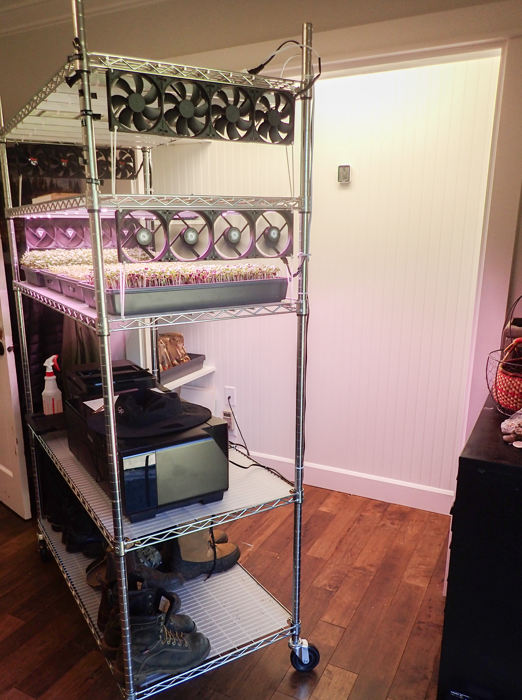

## Where I Grow

When I first started this (mid-pandemic, autumn 2020) I built a simple small rack and kept it in the living room.  It was capable of growing three 10x20 trays.  Once I caught the mg growing bug, however, I knew I needed a bigger rack and was "encouraged" to find someplace not in the main living quarters of the house. So...

I've been working full-time from home for several years. I have a nice home office. My office is technically a bedroom in our house. It also has a large sliding glass door that exits to the backyard. It is the main egress to the backyard. So calling it a bedroom is kind of a non-starter. It is an office. It has one of those closets that usually have a set of bifold doors, so it is quite wide and 24"/70cm deep.  This closet is where I grow.  Before the closet could become a growing facility it needed to be "remodeled" so that it would be visually pleasing with the door removed. So I:

* Removed the bifold doors.
* Trimmed-out the entire closet in bead board (and about 6 tubes of caulk).
* Added shelves to the sides, leaving the entire center portion of the closet open.  
* Added a 12"x36" LED panel light to the top of the closet ceiling (this is closet task lighting, not a grow light).
* Added a light switch just outside the closet for the ceiling light.
* Added a power outlet to the rear closet wall (to power printers, switches, grow lights, etc...).
* Added an Ethernet port to the rear closet wall (for my printers, not used in microgreen growing...yet).

This is where my grow rack lives now.  The shelves are arranged as:

Shelf | Notes
---- | ----
Top | Holds all the power and network infrastructure, generally out-of-sight so it's not clean.
2-3 | Grow Shelves: This let's me grow up to 8 trays simultaneously.
4 | Printer shelf.  So glad to get these off my desktop.
5 | Shoe shelf. So glad to get these of the floor by the door.

If you look closely at the picture above you might deduce (correctly!) that I'm a little OCD about cable management, but only when those cables would be visible.  When it comes to cables in hidden places, I don't bother.  So there are two printers (with power and network cables), 16 fans, and 16 grow lights.  And while the cabling is not 100% perfectly hidden, it is a very clean installation.  For the fans and lights I built custom wiring harnesses to minimize the number of wires that needed managing.  All cables are zip-tied neatly along the backside of the shelf wires and legs.

Most of these NSF style wire racks come with wheels.  The wheels, combined with the very long power cord allow me to roll the entire unit out of the closet space so I can get inside for whatever I need without disconnecting power or network to anything on the rack.

